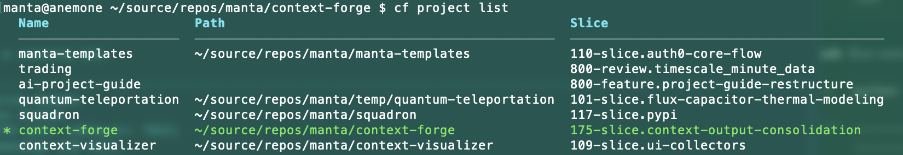
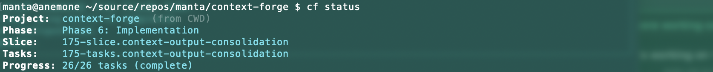
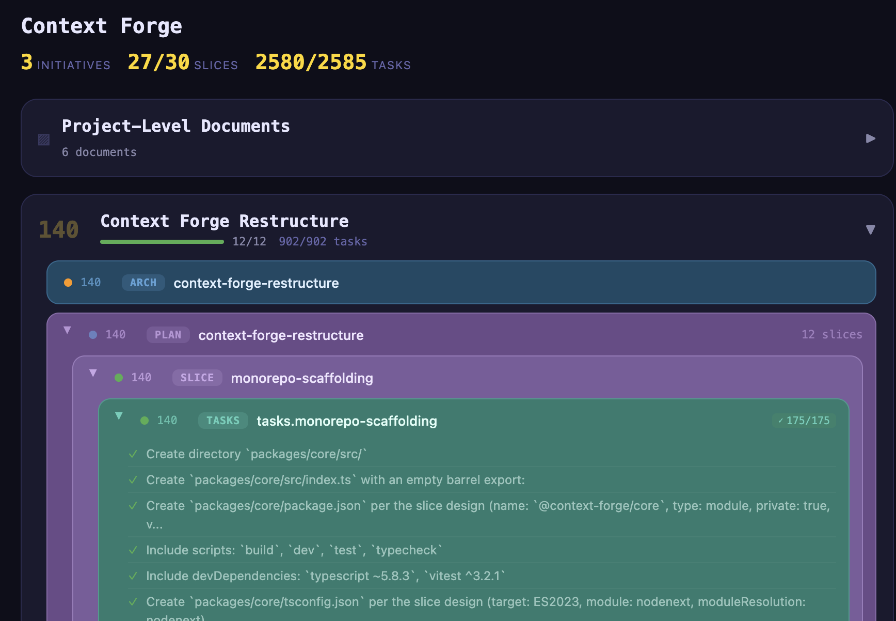

# Context Forge

Context Forge massively speeds the development of large projects with AI agents while maintaining high quality.  

It multiplies your cognitive abilities and doesn't try to replace them. Not another "Hey AI, build me an app" framework, and it may be overkill for building simple gadgets. Development is managed through a structured process, starting with broad initiatives and breaking functionality into vertical slices and individual tasks.  It maintains traceable, hierarchical project state so that every AI session starts with full awareness of where things stand and what's next.

It's designed to be easy for AIs as well.  Every command can output structured JSON.  Easily readable by AI, and usable in pipelines.  The MCP server provides an agent_quickstart to simplify use by AIs.


## What It Looks Like

### CLI
Everything is discoverable under the `cf` command.  Start with `cf --help`.  Easily manage multiple projects.  cf knows which one based on your current directory.  `cf init` to start a new one.  Ideally it will feel similar to git.



Obtain brief status with `cf status`, detailed with `cf project get`. Use the MCP or slash-commands if you prefer.


Your AI assistant sees this too — through MCP tools, through slash commands, through the CLI. It knows the project structure, the methodology phase, the active slice, and (*very* soon) exactly which task to work on next. No "let me catch you up." No re-reading CLAUDE.md. No guessing.

### Visualizer


Context Forge builds big projects fast.  Visualizer is a separate tool to help humans maintain an overview.  Available at:  
https://github.com/ecorkran/context-visualizer


## Get Started

```bash
# 1. Install globally
npm install -g @context-forge/mcp @context-forge/cli

# 2. Add the MCP server (strongly recommended)
claude mcp add --transport stdio context-forge -- npx @context-forge/mcp

# 3. Set up your project — pick one:
cf init                   # CLI: creates project, installs guides, configures IDE, installs slash commands
# — or —
/cf:onboard               # Slash command: AI-guided setup — walks you through everything conversationally
```

That's it. `cf status` works. Your AI assistant can call Context Forge tools. `/cf:build` assembles context. `/cf:onboard` can take a new user from zero to their first concept discussion.

<details>
<summary>MCP server JSON config (for Cursor, Perplexity, Windsurf, etc.)</summary>

```json
{
  "context-forge": {
    "command": "npx",
    "args": ["@context-forge/mcp"],
    "env": {}
  }
}
```

</details>

<details>
<summary>Manual setup (if you prefer step-by-step control)</summary>

```bash
cf guides install          # Install methodology guides into your project
cf setup-ide claude        # Install Claude rules and create CLAUDE.md
cf install-commands        # Install Claude Code slash commands
```

</details>

Requirements: Node.js 18+.

## How It Works
Context Forge is built around a structured development methodology called [ai-project-guide](https://github.com/ecorkran/ai-project-guide). 

Projects progress through phases:
**Concept → Architecture → Slice Planning → Slice Design → Task Breakdown → Implementation → Integration**

Each phase produces documents. Documents reference each other. Slices decompose into tasks. Tasks track completion. The whole thing is a hierarchy you can navigate, introspect, and hand off between humans and agents without losing state.

Context Forge is the engine that:
- **Knows where you are** — parses your project artifacts, reads completion states, understands methodology phase
- **Knows what's next** — workflow navigation recommends the next action with rationale
- **Generates session context** — assembles everything an AI agent needs into a structured prompt, automatically
- **Tracks everything** — persistent project state, two-tier configuration, artifact introspection across all your projects

It manages multiple projects simultaneously. Each one has its own slice plan, its own task state, its own methodology position.

For larger projects with parallel initiatives — running architecture and a feature slice at the same time, for example — worktrees let you run multiple AI sessions in separate git worktrees, each with its own phase/slice/task context, without conflicts.

## Design Philosophy
 
Context Forge resists the urge to be clever on your behalf.
 
We added compound commands — `cf implement` instead of `cf set phase 6 && cf build`. Then we cut them all. They bloated the command surface, cluttered the slash commands, and obscured what was actually happening. The low-level commands were better. They composed. They were transparent. So we went back.
 
This is a pattern, not an accident. The tool stays close to the metal:
 
- **No magic.** You can do everything through MCP if you want, but `cf set phase 6` is a hundred times faster and you should just type it. The MCP tools exist so agents can operate autonomously, not so humans can burn tokens setting a property.
- **No opinions about your stack.** Context Forge doesn't care if you're writing Python, TypeScript, C++, or all three. It manages project state and generates context. Your agents do the rest.
- **No hand-holding.** There's an onboarding flow if you want it (`/cf:onboard`). There's `cf next` if you want guidance. But the tool doesn't gate your progress or force you through ceremonies. You're the architect. Act like it.

### Naming Things
Started as a simple Electron utility called Context Builder, it's long since outgrown its name.  We haven't picked a new one yet.  Naming things is hard.  One of the only two hard things, together with cache invalidation and off-by-one errors.  


## Access Points
Four interfaces — use whichever fits your workflow:

### MCP Server (`@context-forge/mcp`)

34 tools for project management, context generation, artifact introspection, workflow navigation, worktree management, guide management, and configuration. Works with Claude Code, Cursor, or any MCP-compatible client. This is what your AI assistant talks to.

| Category | Tools |
|----------|-------|
| Project | `project_list`, `project_get`, `project_create`, `project_update`, `project_schema`, `project_structure` |
| Context | `context_build`, `context_summarize`, `template_preview`, `prompt_list`, `prompt_get` |
| Workflow | `workflow_status`, `workflow_next`, `workflow_check`, `workflow_future` |
| Worktrees | `worktree_list`, `worktree_get`, `worktree_init`, `worktree_update`, `worktree_rm` |
| Introspection | `introspection_documents`, `introspection_frontmatter`, `introspection_slice_plan`, `introspection_tasks`, `introspection_future_work` |
| Configuration | `config_get`, `config_set` |
| Guides | `guide_install`, `guide_status`, `guide_update` |
| Storage | `storage_backup` |
| Meta | `agent_onboard`, `agent_quickstart`, `server_version` |

### CLI (`@context-forge/cli`)

`cf` works like `git` — install it globally and it detects your project from the current directory. `--json` on every read command for scripting.

| Command | Description |
|---------|-------------|
| `cf init` | Initialize project: git, guides, IDE config, slash commands |
| `cf status` | Workflow status (phase, slice, task progress) |
| `cf next` | Recommended next action with rationale |
| `cf build` | Assemble context prompt for AI session |
| `cf set <field> <value>` | Set a project field |
| `cf get` | Show all project fields |
| `cf check` | Run consistency checks (`--fix`, `--slice`) |
| **Listing** | **Browse project artifacts** |
| `cf list projects` | All registered projects |
| `cf list initiatives` | Architecture initiatives with slice counts |
| `cf list plans` | Slice plan files with progress |
| `cf list slices` | Slices from the active plan with status |
| `cf list tasks` | Task files with completion counts |
| `cf list items` | Individual tasks from the active task file |
| **Management** | |
| `cf project list\|get\|set\|rm` | Manage projects |
| `cf worktree init\|list\|get\|update\|rm` | Manage git worktree contexts |
| `cf config get\|set` | Two-tier configuration |
| `cf future` | Consolidated future work across all plans |
| `cf prompt list\|get <phase>` | Prompt templates with variable substitution |
| `cf guides install\|status\|update\|uninstall` | ai-project-guide template management |
| `cf setup-ide claude` | Configure Claude Code integration |
| `cf backup` | Versioned project data backup (keeps last 10) |

### Claude Code Slash Commands

Installed via `cf install-commands`. Available directly in Claude Code sessions:

| Command | Description |
|---------|-------------|
| `/cf:onboard` | AI-guided project setup and first-phase walkthrough |
| `/cf:build` | Build context prompt (accepts `--phase`, `--slice`) |
| `/cf:status` | Show workflow status |
| `/cf:get` | Show all project fields |
| `/cf:set` | Set a project field |
| `/cf:next` | Recommended next action |
| `/cf:prompt` | Get or list prompt templates |
| `/cf:project` | Manage projects |

### Electron Desktop App

Visual interface for project management, template editing, and context preview. Multi-project support, split-pane editor, light/dark themes.  This has been relegated to 2nd priority.  If you notice issues, please let us know.

## Architecture

pnpm monorepo, four packages:

```
packages/
  core/       @context-forge/core    — context engine, project state, introspection, workflow
  mcp-server/ @context-forge/mcp     — MCP protocol server ([nn] tools)
  cli/        @context-forge/cli     — terminal interface (cf command)
  electron/   @context-forge/electron — desktop app
```

All interfaces consume `@context-forge/core` directly. The MCP server and CLI produce identical results for the same operations — they're different access patterns to the same engine.

1345 tests across all packages. TypeScript, strict mode, no `any`.

## Related

**[context-visualizer](https://github.com/ecorkran/context-visualizer)** — React app that visualizes project structure through the MCP server. See your slice plans, task completion, and project hierarchy rendered visually.

**[ai-project-guide](https://github.com/ecorkran/ai-project-guide)** — The methodology framework. Phases, guides, prompt templates, review rules, IDE configuration. This is what Context Forge's structure is built on. Install it with `cf guides install`.

**[Agent Integration Guide](docs/AGENT-INTEGRATION.md)** — How to integrate with Context Forge from an AI agent, orchestrator, or CI pipeline. Covers MCP tools, CLI `--json` mode, structured errors, and command discovery.

## Published Packages

- [`@context-forge/mcp`](https://www.npmjs.com/package/@context-forge/mcp)
- [`@context-forge/cli`](https://www.npmjs.com/package/@context-forge/cli)
- [`@context-forge/core`](https://www.npmjs.com/package/@context-forge/core)

## License

MIT
