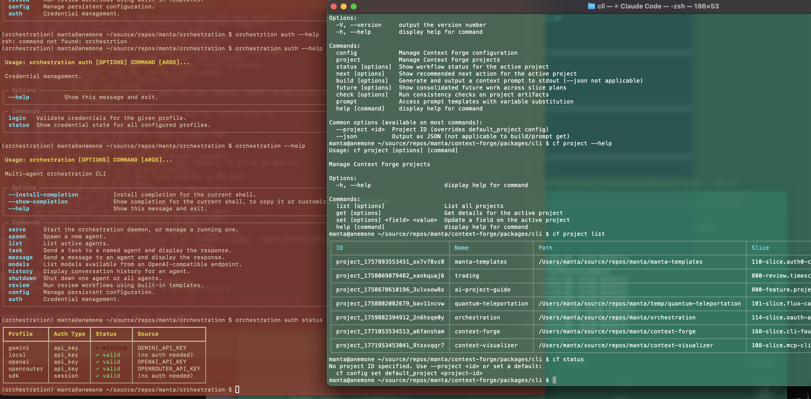

# Slice Design: Multi-Project & UX Polish

## Overview

Extend the `packages/cli` package with CWD-based project detection, name-based project resolution, output formatting improvements, and a version bump to 0.2.0. After this slice, `cf` behaves like a project-aware tool — running `cf status` from inside any registered project directory automatically resolves the correct project, with no flags or reconfiguration required.

After this slice, a developer can `cd ~/repos/context-visualizer && cf status` and get context-visualizer's status. They can `cd ~/repos/orchestration && cf build | pbcopy` and get orchestration's context. The tool follows them, rather than requiring them to manage a "current project" setting.

## Value

**Zero-friction multi-project use.** The single biggest usability gap in the current CLI is that `cf` requires `--project` or a configured default whenever you're not in your primary project. Developers work across multiple projects constantly. CWD detection eliminates this friction by using information already implicit in where you are.

**Human-readable config.** Project IDs (`project_1771053534513_a6fansham`) are machine-generated and opaque. Allowing `cf config set default_project orchestration` and `--project context-visualizer` means config files and command history are readable and maintainable. IDs remain as stable internal identifiers; names become the human interface.

**Consistent resolution semantics.** A well-defined, three-level resolution hierarchy (flag → CWD → default) means behavior is predictable across all commands. Users learn it once; it applies everywhere.

**Output quality.** The 168 output layer was functional-first. Tightening formatting to match orchestration's compact style brings the two tools into alignment, especially important as they converge in the ADP context.

## Technical Scope

### Included

**CWD-based project detection:**
- `findProjectByCwd(store)` utility in `src/utils/project.ts`
- Longest-match path wins (handles being inside a subdirectory of a project)
- Integrated into the `resolveProjectId` chain as the second step
- Resolution source tracking: `"flag"` | `"cwd"` | `"default"` | `"none"`

**Name-based resolution:**
- `findByNameOrId(nameOrId, store)` utility — tries exact ID match first, then case-insensitive name match
- Applied in `resolveProjectId`, `--project` flag, and `cf config set default_project`
- `FileProjectStore` gains a `findByName(name)` method in `@context-forge/core`
- Config stores the value as typed by the user (name or ID); resolution happens at command runtime

**Resolution indicator in output:**
- `cf status` header line shows resolution source: `Project: orchestration  (from CWD)` vs `(default)` vs `(--project flag)`
- Available in `--verbose` mode on all other commands (not shown by default to keep output compact)

**Output formatting improvements:**
- Compact table format matching orchestration style: tighter column spacing, grouped sections, no excess blank lines
- Status output: single-screen summary with key metrics grouped logically
- `cf project list` table: compact with aligned columns
- `cf config list` table: compact, source column right-aligned
- Error messages: consistent format with actionable next steps

**Version bump:**
- `packages/cli/package.json`: `0.1.0` → `0.2.0`
- Changelog note in `packages/cli/README.md`

**Config key noted (not wired):**
- Document `default_additional_instruction` as a planned config key in README
- No implementation — deferred to a future slice when `cf build` default behavior is revisited

### Excluded

- **Interactive project switching** — No `cf use <project>` command that mutates a "current project" setting. The CWD model replaces this need.
- **Project aliases** — Friendly short names beyond what's already in `project.name`. The name field is the alias.
- **Shell prompt integration** — Showing current cf project in PS1/shell prompt. Interesting but out of scope.
- **`default_additional_instruction` implementation** — Config key design is deferred; just document the intent.
- **`cf check` wiring** — Still waiting on slice 166; remains stubbed.

## Architecture

### Resolution Chain

Every command that operates on a project calls `resolveProjectId` in `src/utils/project.ts`:

```typescript
type ResolutionSource = 'flag' | 'cwd' | 'default' | 'none';

interface ResolvedProject {
  id: string;
  source: ResolutionSource;
}

async function resolveProjectId(
  explicit: string | undefined,
  store: FileProjectStore,
  config: ConfigManager
): Promise<ResolvedProject> {
  // 1. Explicit --project flag (highest priority)
  if (explicit) {
    const project = await findByNameOrId(explicit, store);
    if (!project) throw new UserError(`Project '${explicit}' not found.`, store);
    return { id: project.id, source: 'flag' };
  }

  // 2. CWD detection
  const cwdProject = await findProjectByCwd(store);
  if (cwdProject) {
    return { id: cwdProject.id, source: 'cwd' };
  }

  // 3. default_project config
  const defaultProjectRef = config.get('default_project');
  if (defaultProjectRef) {
    const project = await findByNameOrId(defaultProjectRef, store);
    if (project) return { id: project.id, source: 'default' };
    // default_project is set but doesn't match — warn rather than silently fail
    throw new UserError(
      `default_project is set to '${defaultProjectRef}' but no matching project was found.\n` +
      `  cf project list    # to see available projects\n` +
      `  cf config set default_project <name>    # to update`
    );
  }

  // 4. No resolution
  throw new UserError(
    'No project specified and no registered project found at current path.\n' +
    '  Use --project <name> to specify a project, or\n' +
    '  cf config set default_project <name>    # to set a default\n' +
    '  cf project list    # to see available projects'
  );
}
```

### CWD Detection

```typescript
async function findProjectByCwd(store: FileProjectStore): Promise<ProjectData | null> {
  const projects = await store.list();
  const cwd = process.cwd();

  // Normalize paths: ensure trailing slash for prefix matching
  const matches = projects
    .filter(p => p.projectPath && (
      cwd === p.projectPath ||
      cwd.startsWith(p.projectPath.endsWith('/') ? p.projectPath : p.projectPath + '/')
    ))
    .sort((a, b) => b.projectPath.length - a.projectPath.length); // longest match wins

  return matches[0] ?? null;
}
```

The longest-match sort handles an unlikely but possible case: two registered projects where one's path is a subdirectory of the other. Longest path wins — you're in the more specific project.

### Name-Based Resolution

```typescript
async function findByNameOrId(
  nameOrId: string,
  store: FileProjectStore
): Promise<ProjectData | null> {
  const projects = await store.list();

  // 1. Exact ID match
  const byId = projects.find(p => p.id === nameOrId);
  if (byId) return byId;

  // 2. Case-insensitive name match
  const lower = nameOrId.toLowerCase();
  const byName = projects.find(p => p.name?.toLowerCase() === lower);
  return byName ?? null;
}
```

Note: `findByNameOrId` lives in `packages/cli/src/utils/project.ts`. The `FileProjectStore` in `@context-forge/core` does not need a new method — the utility function does the lookup against the store's existing `list()` API. This keeps the change contained to the CLI package.

### Resolution Indicator Display

`cf status` shows the resolution source as a parenthetical on the project line:

```
Project: orchestration  (from CWD)
Phase:   implementation
Slice:   115-conversation-persistence  (in progress)
Tasks:   7/14 complete
...
```

Source labels:
- `(from CWD)` — matched by directory
- `(default)` — matched by `default_project` config
- `(--project flag)` — explicitly specified

When resolution source is `flag`, the label is shown always (confirms what was passed). When source is `cwd` or `default`, shown by default in `cf status` header only; suppressed on other commands unless `--verbose`.

## Command Changes

### `cf status` — updated header

Resolution indicator added to project line. No other behavioral change.

```
Project: context-visualizer  (from CWD)
Phase:   slice-design
Slice:   03-data-pipeline  (not started)
Tasks:   —

Slice Plan: 100-slices.context-visualizer
  Completed:  2/5 slices
  Active:     03-data-pipeline
  Next:       03-data-pipeline
```

### `cf config set default_project` — name accepted

```bash
cf config set default_project orchestration      # name
cf config set default_project context-forge      # name with hyphen
cf config set default_project project_177...     # ID still works
```

Stores exactly what the user typed. Resolution at runtime converts it.

### All commands — `--project` accepts names

```bash
cf status --project context-visualizer
cf build --project orchestration --phase design
cf future --project context-forge
```

### `cf project list` — compact format

```
  Name                  Path                                       Slices   Default
  ────────────────────  ─────────────────────────────────────────  ───────  ───────
  context-forge         ~/source/repos/manta/context-forge         7/12     ●
  orchestration         ~/source/repos/manta/orchestration         10/18
  context-visualizer    ~/source/repos/manta/context-visualizer    2/5
```

The `Default` column shows a bullet on the project matching `default_project` config. Replaces the current ID-centric display.

## Dependencies

### Prerequisites

| Dependency | Status | What This Slice Consumes |
|---|---|---|
| 168: CLI Foundation | Complete | All commands, `resolveProjectId`, `FileProjectStore`, `ConfigManager` |

### Core Package Changes

- No new external dependencies
- No changes to `@context-forge/core` public API
- `findByNameOrId` and `findProjectByCwd` are CLI-layer utilities; they call `store.list()` which already exists
- If `store.list()` returns sufficient data (id, name, projectPath), no core changes needed — verify at implementation time

## Success Criteria

### Functional

- `cd ~/repos/orchestration && cf status` resolves to the orchestration project with no flags or config
- `cd /tmp && cf status` falls back to `default_project` config, no error if set
- `cd /tmp && cf status` gives actionable error if `default_project` is also not set
- `cf config set default_project orchestration` works and persists the name
- `cf status` after the above shows `(default)` resolution indicator
- `cf --project context-visualizer status` works from any directory
- `cf project list` shows `Default` indicator on the configured default project
- Two terminal windows in different project directories each resolve independently and correctly

### Technical

- `findProjectByCwd` returns the longest-matching project when paths overlap
- `findByNameOrId` handles exact ID match, case-insensitive name match, and missing project (returns null)
- `resolveProjectId` resolution chain respects priority order in all combinations
- All existing 168 tests continue to pass
- New unit tests for `findProjectByCwd` (no match, exact match, subdirectory match, longest-match tie-break)
- New unit tests for `findByNameOrId` (ID match, name match, case insensitivity, not found)
- New unit tests for `resolveProjectId` (each resolution path, missing default_project target)

## Implementation Notes

Suggested task order:

1. `findByNameOrId` utility + unit tests — no dependencies, verify immediately
2. `findProjectByCwd` utility + unit tests — no dependencies, verify immediately
3. Update `resolveProjectId` to three-step chain with `ResolutionSource` return — wire in the two new utilities
4. Update `cf status` to display resolution indicator — visible proof the chain works
5. Update `cf config set default_project` to accept names (no code change needed — it already stores whatever value you pass; the resolution at runtime handles it)
6. Update `cf project list` to compact format with Default indicator
7. Output formatting pass across remaining commands
8. Version bump + README changelog

Steps 1–3 are the core; steps 4–8 are mechanical and can be done in any order.

## Example UI
Comparison of current (green terminal background), and orchestration CLI (brick-red background).  Note that the backgrounds are specific to the terminal, we are concerned only with foreground colors.
